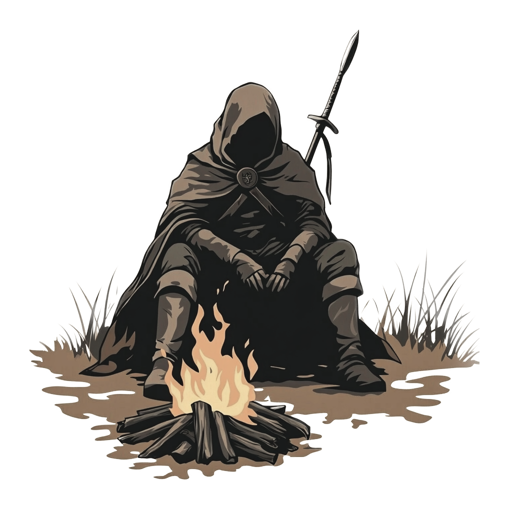

    

        

            <h1 class="text-home-header">MONOMITO</h1>
            <h1 class="text-home-header2 ">
            An Open-License, theme agnostic RPG system designed for creating narrative adventures and gamebooks.
            </h1>
            

            <a class="btn btn-lg btn-secondary me-3 mb-4 text-black" href="">
            Getting Started <i class="fa-solid fa-circle-right ms-2 "></i></a>
            

        

        

        
        

    

    

    

        
        

    <h1 class="text-white text-home-header">MONOMITO</h1>
    
Ambitioni dedisse scripsisse iudicaretur. Cras mattis iudicium purus sit amet fermentum. Donec sed odio operae, eu vulputate felis rhoncus. Praeterea iter est quasdam res quas ex communi. At nos hinc posthac, sitientis piros Afros. Petierunt uti sibi concilium totius Galliae in diem certam indicere. Cras mattis iudicium purus sit amet fermentum.

    

    

    <a class="btn btn-lg btn-secondary me-3 mb-4 text-black" href="">
    Getting Started <i class="fa-solid fa-circle-right ms-2 "></i></a>
    


{}
Allows players to experience deep stories without the need for a traditional Game Master.
{}
{}
We do a [Pull Request](https://github.com/gohugoio/hugo/pulls) contributions workflow on **GitHub**. New users are always welcome!
{}
{}
For announcement of latest features etc.
{}
